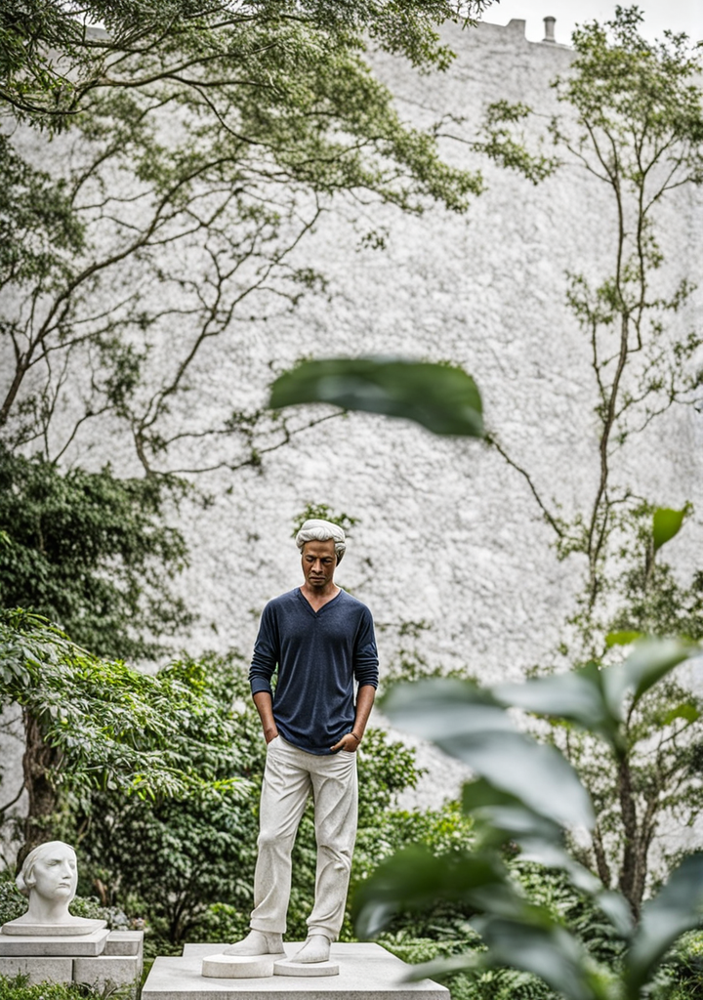

# Week 1 Practice set

## Text-to-image Progression

**Task**: Generate images from text at different stages of the mode's iteration process at 10, 15, 20, 15, 20 steps.

**Tool used**: [Playground](https://playground.com/)

**Filter**: RealVis XL

**Model**: Stable Diffusion XL

**Prompt Guidance**: 7

**Refinement**: 64

**Seed**: 109099558

**Sampler**: DPM++ 2M Karras

**Prompt**: "King positioned on an iron throne, captured mid-preparation for warfare, armoured, sword grasped, adorned in a black and red robe, crowned, studio lighting enhancing the scene, ultra clear, dramatic lighting."

**Negative Prompt**: "Ugly, deformed, noisy, blurry, distorted, crown, tiara, out of focus, bad anatomy, extra limbs, poorly drawn face, poorly drawn hands, missing fingers, nudity, nude"

### Results

| STEPS | RESULTS                  |
| ----- | ------------------------ |
| 10    |  |
| 15    |  |
| 20    |  |
| 25    |  |
| 30    |  |

## Image-to-image Variation

**Task**: Modify an existing image at varying strengths (20, 40, 60, 80, 100) to observe the intensity of changes.PGenerate images with specific control over traits (pose, edge, depth), adjusting the influence of each trait.

**Tool used**: [Playground](https://playground.com/)

**Filter**: RealVis XL

**Model**: Stable Diffusion XL

**Prompt Guidance**: 7

**Refinement**: 64

**Seed**: 327138681

**Sampler**: DPM++ 2M Karras

**Prompt**: "A marble sculpture standing in a garden."

**Negative prompt**: "ugly, deformed, noisy, blurry, distorted, out of focus, bad anatomy, extra limbs, poorly drawn face, poorly drawn hands, missing fingers, nudity, nude"

### Results

| STRENGTH | RESULTS                           |
| -------- | --------------------------------- |
| 20       |    |
| 40       |    |
| 60       |    |
| 80       |    |
| 100      |  |

## Control Traits in Image Generation

**Task**: Generate images with specific control over traits (pose, edge, depth), adjusting the influence of each trait.

**Tool used**: [Playground](https://playground.com/)

**Filter**: RealVis XL

**Model**: Stable Diffusion XL

**Prompt Guidance**: 7

**Refinement**: 64

**Seed**: 368710

**Sampler**: DPM++ 2M Karras

### Pose

**Reference Image**

**Prompt**: "A steampunk sci-fi warrior stands in front of a destroyed city with a post-apocalyptic atmosphere and dramatic lighting."

**Negative prompt**: "ugly, deformed, noisy, blurry, distorted, out of focus, bad anatomy, extra limbs, poorly drawn face, poorly drawn hands, missing fingers, nudity, nude"

### Results

| WEIGHT | RESULTS                       |
| ------ | ----------------------------- |
| 0.2    |  |
| 0.8    |  |
| 1.2    |  |
| 2      |      |

### Edge

**Reference Image**

**Prompt**: "Portrait of a steampunk sci-fi warrior wearing a gas mask in a destroyed city in the background."

**Negative prompt**: "ugly, deformed, noisy, blurry, distorted, out of focus, bad anatomy, extra limbs, poorly drawn face, poorly drawn hands, missing fingers, nudity, nude"

### Results

| EDGE | THRESHOLD | RESULTS                     |
| ---- | --------- | --------------------------- |
| 0.2  | 139       |  |
| 0.5  | 200       |  |
| 0.6  | 120       |  |
| 1    | 200       |    |
| 1    | 255       |    |
| 2    | 255       |    |

### DEPTH

**Reference Image**

**Prompt**: "batman standing in front of the Whitehouse"

**Negative prompt**: "ugly, deformed, noisy, blurry, distorted, out of focus, bad anatomy, extra limbs, poorly drawn face, poorly drawn hands, missing fingers, nudity, nude"

### Results

| DEPTH | RESULTS                   |
| ----- | ------------------------- |
| 0.2   |  |
| 0.6   |  |
| 1     |    |
| 1.5   |  |
| 2     |    |

## Reverse Prompting

**Task**: Create an image from a prompt and then generate a text description that accurately matches the produced image.

**Tool used**: [Playground](https://playground.com/)

**Model**: Playground 2.5

**Reference Image**

**Reverse Prompt Image**

**Prompt**: "Pixar animated soft 3d character, Pixar 3d style, Closeup shot of a sweet cheerful boy with a big smile facing front, visible teeth, wearing a red puffy hoodie jacked charcoal grey undershirt, with a backpack with a black strap, brown messy hair, big brown expressive eyes, black background, intense flames in blurred background, face lit up by fire."

**Negative prompt**: "ugly, deformed, noisy, blurry, distorted, out of focus, bad anatomy, extra limbs, poorly drawn face, poorly drawn hands, missing fingers, nudity, nude"
