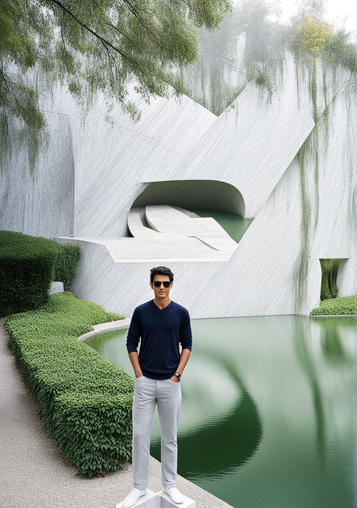
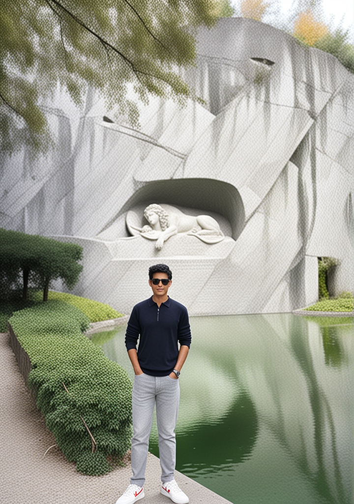

# Week 1 Practice set

## Text-to-image Progression

**Task**: Generate images from text at different stages of the mode's iteration process at 10, 15, 20, 15, 20 steps.

**Tool used**: [Playground](https://playground.com/)

**Filter**: RealVis XL

**Model**: Stable Diffusion XL

**Prompt Guidance**: 7

**Refinement**: 64

**Seed**: 109099558

**Sampler**: DPM++ 2M Karras

**Prompt**: "King positioned on an iron throne, captured mid-preparation for warfare, armoured, sword grasped, adorned in a black and red robe, crowned, studio lighting enhancing the scene, ultra clear, dramatic lighting."

**Negative Prompt**: "Ugly, deformed, noisy, blurry, distorted, crown, tiara, out of focus, bad anatomy, extra limbs, poorly drawn face, poorly drawn hands, missing fingers, nudity, nude"

### Results

| STEPS | RESULTS                  |
| ----- | ------------------------ |
| 10    |  |
| 15    |  |
| 20    |  |
| 25    |  |
| 30    |  |

## Image-to-image Variation

**Task**: Modify an existing image at varying strengths (20, 40, 60, 80, 100) to observe the intensity of changes.PGenerate images with specific control over traits (pose, edge, depth), adjusting the influence of each trait.

**Tool used**: [Playground](https://playground.com/)

**Filter**: RealVis XL

**Model**: Stable Diffusion XL

**Prompt Guidance**: 7

**Refinement**: 64

**Seed**: 327138681

**Sampler**: DPM++ 2M Karras

**Prompt**: "A marble sculpture standing in a garden."

**Negative prompt**: "ugly, deformed, noisy, blurry, distorted, out of focus, bad anatomy, extra limbs, poorly drawn face, poorly drawn hands, missing fingers, nudity, nude"

### Results

| STRENGTH | RESULTS                           |
| -------- | --------------------------------- |
| 20       |    |
| 40       |    |
| 60       |    |
| 80       |    |
| 100      |  |
